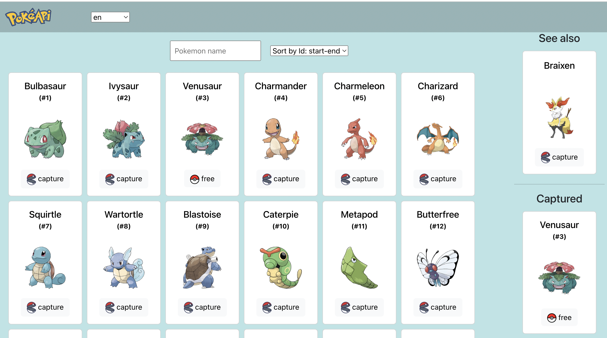
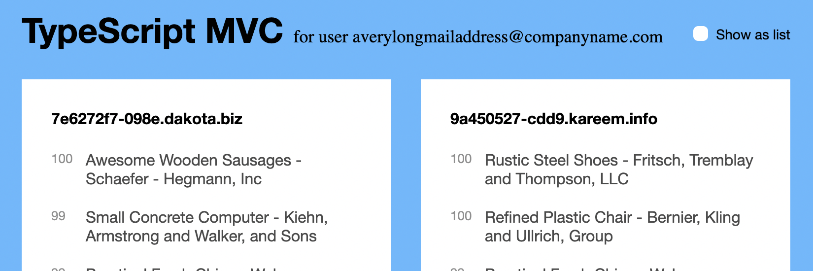
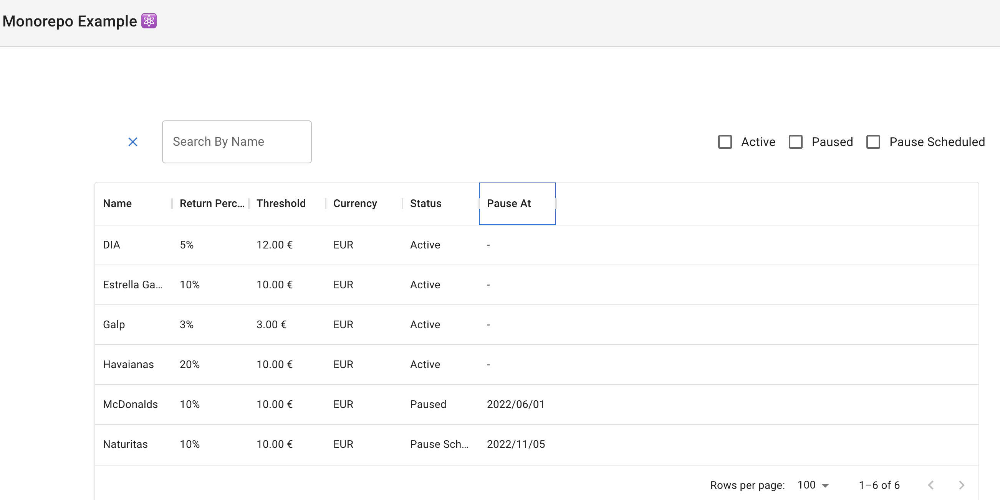

# Monorepo with examples

| Image  | Name  | Link  | Description  |
|---|---|---|---|
 | React Typescript Pokedex Rest | [http://localhost:3001/pokedex](http://localhost:3001/pokedex) | [Readme](./packages/pokedex/README.md) |
 | Vanilla TypeScript MVC | [http://localhost:3030/](http://localhost:3030/) | [Readme](./packages/typescript-mvc/README.md) |
 | Form| [http://localhost:3005/](http://localhost:3005/) |[Readme](./packages/form/README.md)  |

## Technologies & Approaches:

- [x] General:
    - [x] Monorepo
    - [x] yarn
    - [x] TypeScript and Typedoc
    - [x] MVC on TS classes (in TypescriptMVC project)
    - [x] Add modules aliases with Craco
    - [x] Reusable components
    - [x] Documentation:
        - [x] ADd documents folder
        - [x] Doc - how to start
        - [x] Doc - how it works with architectural diagram
        - [x] add structure description readme
        - [x] Added troubleshooting doc
        - [x] Add TypeDoc
- [x] Testing:
    - [x] Storybook:
    - [x] Cypress
        - [x] lighthouse and a11y review
        - [x] Visual Regression Testing
        - [x] unit tests
- [x] Styles
  - [x] SCSS
  - [x] Material UI and Bootstrap frameworks
  - [x] Atomic Design
- [x] DevOps and EngExcellence:
    - [x] DotFiles:
        - [x] add .nvmrc with version
        - [x] Add .npmrc
    - [x] Linters:
        - [x] Move linter configs to separate files
        - [x] Add Eslint, Prettier
        - [x] Add Husky
    - [x] Git Commit template
    - [x] Git PR template
    - [x] Git auto PR deployment
    - [x] Eslint, Stylelint, Prettier, Husky precommit
    - [x] Stylelint, scss support
    - [x] GitHub issues templates and workflows action "Build to GitHub pages"
    - [x] Browsers list with browser support: latest 2 versions of Chrome, Firefox, Safari, Edge, Opera.
    - [x] Webpack
      - [x] Webpack Bundle Analyzer

## Next Plans
- [ ] Add Mirage.js support
- [ ] Move popular components to "components package"
- [ ] Move storybook to separate components
- [ ] Add TypeScript Decorators
- [ ] docker
- [ ] Add GraphQL Example
- [ ] Add React Native example
- [ ] Add Progressive Web Application support (Workbox)
- [ ] export vscode configs extensions and settings
