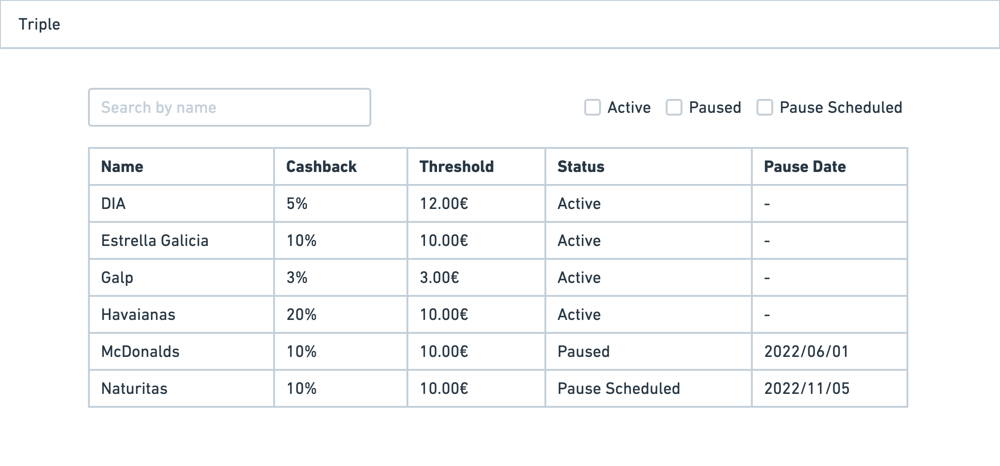

# Frontend exercise

---

## Table of Contents:

- [Task (Current)](01-task.md)
- [Introduction](02-introduction.md)
- [Solution Description](03-solution-description.md)
- [Trouble Shooting](04-troubleshooting.md)
- [Api Generated Documentation](generated/index.html)

---

Hello! Thank you for taking the Triple frontend exercise. The goal is to implement a simple feature in a given code.

Some code could be poorly structured, so feel free to refactor anything that you would consider.

Please, if you have any doubts about the exercise, please contact us. You can find our emails in the invite.

## Feature request (EXERCISE)

Given a table of programs, we would like to be able to filter the API results:

- Searching by name of the program
- Filtering by status of the program

Programs have 3 different possible statuses: ACTIVE, PAUSED and PAUSE_SCHEDULED

Here we provide a mockup of how the app could look:

### What we expect

- See how your code is structured
- See how you would refactor some existing code to improve the codebase
- Our code is not tested properly! Add tests where considered :)

## API description

We expose an endpoint that can be found in http://localhost:4002/programs .

You can search programs by name using: http://localhost:4002/programs?name_like=dia

You can apply filters to the status attribute, using for example: http://localhost:4002/programs?status=ACTIVE

If no filters are set, it returns by default all the programs

## Tools and libraries

- We used MUI https://mui.com/ for visual components. Feel free to use any of them to improve the look and feel of the app. Some components, like the Progress indicator, would be good candidates to improve some existing code that gives the user a poor visual experience.
- Feel free to use any additional library you may need to use.
- For testing, we expect to use react-testing-library, but if you have any other preference please use it and we can comment in the PR/interview.
