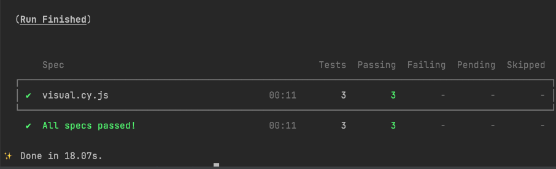

# Solution Description

## Table of Contents:

- [Introduction](./01-introduction.md)
- [Solution Description (current)](./02-solution-description.md)
- [Task](./03-task.md)

---

## BrowserList

The config to share target browsers between different front-end tools.
Set up to maintain latest 2 versions of browser.

## CI:CD

- Prettier, Stylelint, Eslint and husky setup and synced to provide unified approached for code styling and implement them on each commit
- .gitmessage file
- github issues templates and workflows action "Build to github pages"

## Testing: Cypress and Jest

- Testing tools to maintain unit test and e2e test coverage with reporting.

### Jest Example

### Cypress has next plugins:

- Visual regression testing - to maintain visual comparison of project.
  

- 

- lighthouse and a11y report

## Site Score:

## .nvmrc

To use exact node version across devises.

## Webpack

webpack is a module bundler. Its main purpose is to bundle JavaScript files for usage in a browser.
Maintain next features:

- Alias - to have file aliases started from @/
- Dev Server
- SCSS support
- Webpack Plugin that Visualize size of webpack output files with an interactive zoomable treemap.
   . Analyzer (http://127.0.0.1:8888/)[http://127.0.0.1:8888/]
