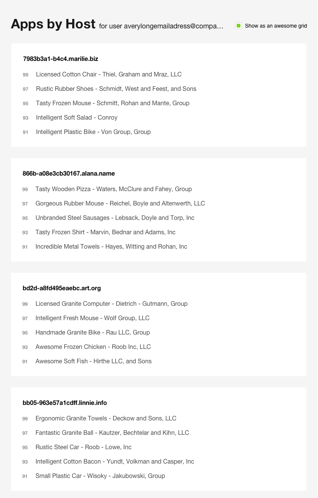
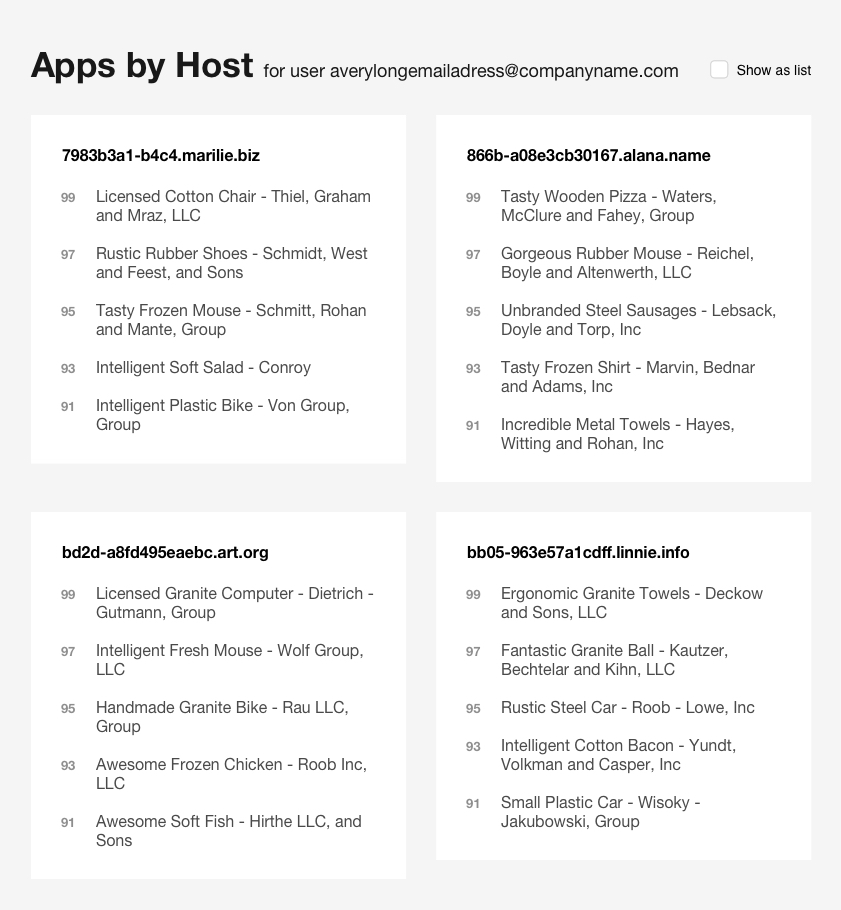

# Task

## Table of Contents:

- [Introduction](./01-introduction.md)
- [Solution Description](./02-solution-description.md)
- [Task(current)](./03-task.md)

---

## The task

Code challenge We want to build a new page view that
shows the list of applications running on every host. ● An application has a
name, a list of contributors, a release version number, and a list of hosts that
the app has been deployed at. ● Each application has an Apdex metric assigned.
The Apdex score is a positive integer between 0 (Frustrated) and 100 (Satisfied)
. Apdex is an industry-standard to measure users' satisfaction based on the
response time of web applications and services. You are asked to build a new
feature to display the most satisfying applications deployed on each host. You
can find attached a JSON file (host-app-data.json) with the data required for
this exercise. ● You must write well-organized code that:
○ Models the described problem with a suitable class hierarchy. ○ Implements the
“getTopAppsByHost” method that, given a hostname, retrieves a list of the 25
most satisfying applications. ○ Implements the “addAppToHosts” and
“removeAppFromHosts” methods, which update the list of applications with higher
Apdex whenever any of these methods is called. (Hint: Be warned that when an app
gets removed, “getTopAppsByHost” still has to return 25 items). These two
methods are not triggered from anywhere in the design: that’s ok, in this case
we care about the logic and not about the UI layer.

● You must implement a UI, based on the provided mockups:
○ Each card representing a host must display its top 5 apps ordered by
satisfaction. ○ As shown in the mockups, there are two types of layouts (grid
and list) and when clicking on the checkbox the layout changes. ○ When clicking
over an app, an alert dialog including the release number has to be shown.

○ Browser support: latest 2 versions of Chrome, Firefox, Safari, Edge, Opera.

Requirements and restrictions ● Each application list is always ordered by
Apdex. The first app is the one with the highest Apdex. From top to bottom, most
satisfied to most frustrated app. ● For this specific solution, you do not need
to worry about changes on the Apdex metric of an application. ● Provide source
code, not the compiled code. Please DO NOT share the solution through a public
source code system (GitHub, GitLab...)
● Do not use frameworks / libraries such as React, Angular, etc. Things we are
looking for ● Maintainable and well-written code using good object oriented
practices. ● Specify Big-O notation of your algorithm. You should strive for an
optimal solution. Things that we are NOT looking for ● Database or any data
source connection or any kind of ORM. It’s OK to read the provided JSON file all
at once. ● Using 3rd party libraries such as JS or CSS libraries (i.e Angular,
React...). Except for the ones to assist your development such as test or build
frameworks.

[Example data JSON file]

[UI mockups]

### List Mode

### Grid Mode

### Grid Mode Sizing

